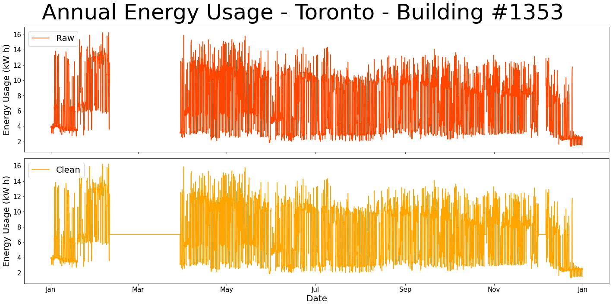
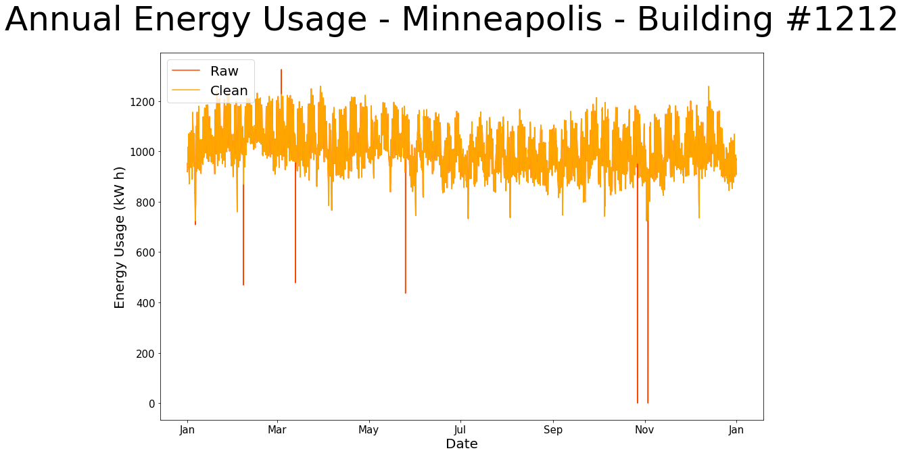
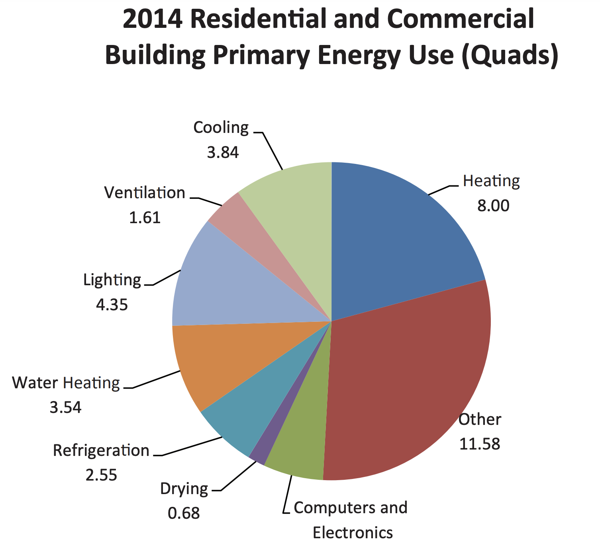
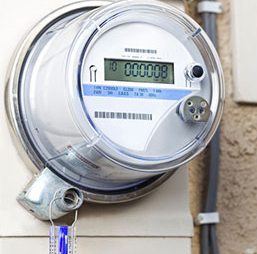
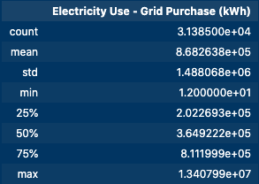
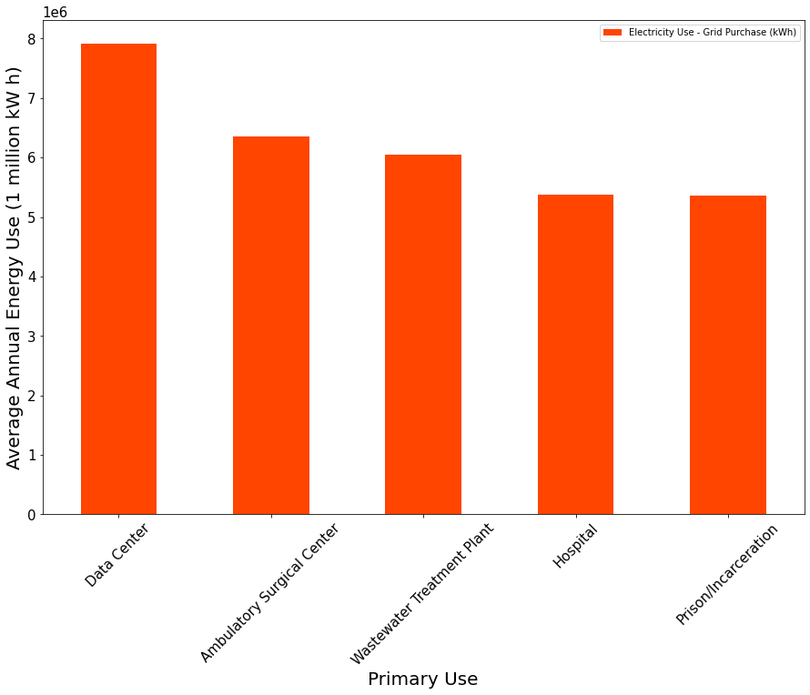
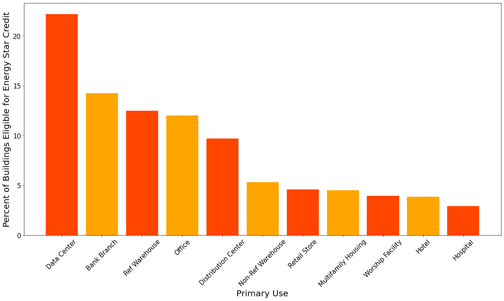

# Predicting Building Energy Use


## Project Understanding

This CAPSTONE repo includes two separate projects focused on predicting energy usage of buildings. The initial project focuses on this Kaggle Competition for predicting hourly building energy use based on static building metadata and hourly weather data. This project is summarized in the first Technical Overview section of this readme. The work done for this project can be viewed in the appendix folder of this repo. 

Due to time constraints of the CAPSTONE, work is shifted to another dataset with similar business problem. Predicting annual electricity usage of buildings in New York City using features like size, building type and energy efficiency. The bulk of this README and repo focus on this project. All model evaluation and business problem recommendations are done solely using the New York City project. Files with the prefix **kaggle** correspond to the unfinished first project. Files with the prefix **NYC** correspond to the final project.

#### Project Understanding and Technical Overview - Kaggle Dataset 

From the [Kaggle Competition Overview](https://www.kaggle.com/c/ashrae-energy-prediction/overview) - "*Significant investments are being made to improve building efficiencies to reduce costs and emissions. The question is, are the improvements working? That’s where you come in. Under pay-for-performance financing, the building owner makes payments based on the difference between their real energy consumption and what they would have used without any retrofits. The latter values have to come from a model. Current methods of estimation are fragmented and do not scale well. Some assume a specific meter type or don’t work with different building types. In this competition, you’ll develop accurate models of metered building energy usage in the following areas: chilled water, electric, hot water, and steam meters. The data comes from over 1,000 buildings over a three-year timeframe. With better estimates of these energy-saving investments, large scale investors and financial institutions will be more inclined to invest in this area to enable progress in building efficiencies.*"

The primary workload with this project ends up being the data cleaning. The target data supplied for the competition is raw building meter readings. Errors such as:

    * Broken meter (long stretches of single reading)
    * Erratic high or low values
    * Missing Values

need to be identified and either fixed or removed from consideration. A couple examples of the data cleaning are shown below.

* Fixing Missing Entries:



* Fixing Erratic Readings:



The original goal was to use all observations of this dataset as the train data and submit predictions on the kaggle competition test data as per the instructions of the competition. Due to running out of time, in an attempt to get a performance metric, a late train/test split is performed. Several operations have been done prior to this train test split (i.e. imputing) so data leakage is present and the results are more or less meaningless. This project ends up being an exercise in data cleaning and data understanding. The work for this project can be seen in this [notebook](./appendix/kaggle_multicity_weather_building_energy_model.ipynb).

Next, a simpler approach is taken to produce a working model for predicting building energy usage. Instead of looking at hourly information, data is summed up after data cleaning by building to produce unique building observations for the year. This method produces interpretable results and the work for this can be seen in this [notebook](./appendix/kaggle_multicity_building_energy_model.ipynb).

#### Project Understanding and Technical Overview - NYC Building Annual Energy Use

This project covers the modeling performed with the [NYC Open Data](https://data.cityofnewyork.us/Environment/Energy-and-Water-Data-Disclosure-for-Local-Law-84-/usc3-8zwd) dataset to predict annual electricity usage for buildings. The model uses building size, primary use and energy efficiency information to make a prediction on the annual electricity use. Identifying the important features in determining electricity use could help to inform energy credit programs that can incentivize energy abusers.

The first simple model uses linear regression which produces an RMSE of 940 MWh. The final ensemble model is a Random Forest Regressor which produces an RMSE of 614 MWh. The average annual electricity usage for a building >50,000 sqft in NYC is 975 MWh +/- 1,700 MWh.


# NYC Building Annual Energy Use Project

## Business Understanding

Buildings account for 76% of all electricity use in the United States. This translates to 40% of total greenhouse gas emissions from baseline power (coal and oil). Over half of a buildings energy draw comes from environment control:

* lighting
* cooling
* heating
* ventilation
* refrigeration



New York State Energy Plan:

*"The State Energy Plan is a comprehensive roadmap to build a clean, resilient, and affordable energy system for all New Yorkers. The Plan coordinates every State agency and authority that touches energy to advance the REV agenda, unleashing groundbreaking regulatory reform to integrate clean energy into the core of our power grid, redesigning programs to unlock private capital, and actively deploying innovative energy solutions across the State’s own public facilities and operations."* ([EnergyPlan.NY.gov](https://energyplan.ny.gov/))

The plan has the following goals for the state:

* 40% reduction in greenhouse gas emissions from 1990 levels
* 50% of energy generation from renewable energy sources
* 600 trillion Btu increase in statewide energy efficiency

Being able to predict the annual electricity usage of a building based on it's size, primary use and energy efficiency rating would allow for better municipal planning and could help with identifying buildings that over-consume. This would be ideal for planning city sustainability projects as energy consumption could be predicted based on a forecasted change in energy efficiency of buildings. Based on required energy reductions predicted by this model the state could tailor sustainability programs to incentivize building managers to increase energy efficiency (reduce energy consumption).

## Data Understanding

The data comes from [NYC Open Data](https://data.cityofnewyork.us/Environment/Energy-and-Water-Data-Disclosure-for-Local-Law-84-/usc3-8zwd). The target column is the 'Electricity Use - Grid Purchase (kWh)'. Here, the dataset is read in and the used columns are filtered for.

**Target Variable - Annual Energy Usage (kW h):**

Energy use is typically tracked in kWh using electric meters installed by a utility company. NYC's Local Law 87 requires that buildings over 50,000 sqft undergo energy audits which include accurate, annual reporting of energy usage. Over 30,000 buildings within New York City fall under this law.



**Building Energy Efficiency:**

A building's EnergyStar Score is a relative benchmark to other buildings of similar qualities. The higher the score the more energy efficient that building is. An EnergyStar Score of 50 is the median energy efficiency. In the state of New York, buildings above an EnergyStar Score of 70 are eligible for rebates through special state run programs.

**Primary Use:**

The primary use of a building is a general building classification. The top 5 classifications:
1. Multifamily Housing
2. Office
3. K-12 School
4. College/University
5. Hotel

## Findings

A Random Forest Regressor is used as the final model which produced the lowest RMSE of 614 MW h.



This is half of a standard deviation of annual usages for the full dataset.



The top energy users fall into categories that typically have large square footage buildings and contain energy intensive processes.



The above graph shows the top performing primary uses by percentage of buildings that qualify for Energy Star Credit (70th percentile for energy efficiency). Ambulatory/Surgical Centers and Prisons while being in the top for energy consumption are not present in the top performing primary uses.

## Recommendations

- Focus energy efficiency incentive programs on high energy use buildings that have the highest percentage of low EnergyStar Scores (Prisons, Surgical Centers, Wastewater Treatment Plants)
- Forecast Energy Annual Usage by making predictions with targeted EnergyStar Scores

## Future Research

- Use sub-metering data in the model to include the exact energy use (HVAC,Lighting,Computers). For example, understanding which energy use by primary use of the building could help with creating more targeted incentive programs and recommended solutions.
- Incorporate weather data to show effects of seasonality on energy use

## More Information

For more information on the NYC project see the [Jupyter Notebook](./NYC_building_energy_model.ipynb) or the [presentation](./NYC_building_energy_presentation.pdf)

## Citations

https://www.energystar.gov/buildings/tools-and-resources/energy-star-score-hospitals-general-medical-and-surgical

https://energyplan.ny.gov/

https://www.kaggle.com/c/ashrae-energy-prediction/discussion

https://data.cityofnewyork.us/Environment/Energy-and-Water-Data-Disclosure-for-Local-Law-84-/usc3-8zwd


```
├── appendix
│   ├── kaggle_multicity_building_energy_model.ipynb
│   ├── kaggle_multicity_weather_building_energy_model.ipynb
├── data
├── images
├── README.md
├── environment.yml
├── NYC_energy_presentation.pdf
├── NYC_energy_notebook.ipynb
└── NYC_energy_notebook.pdf