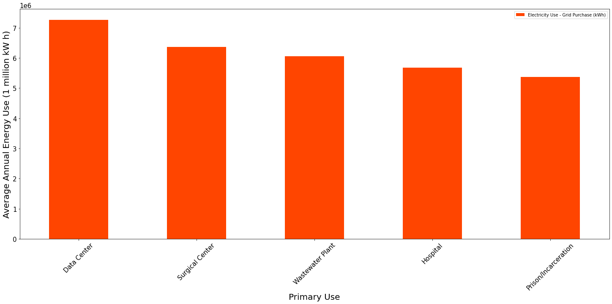
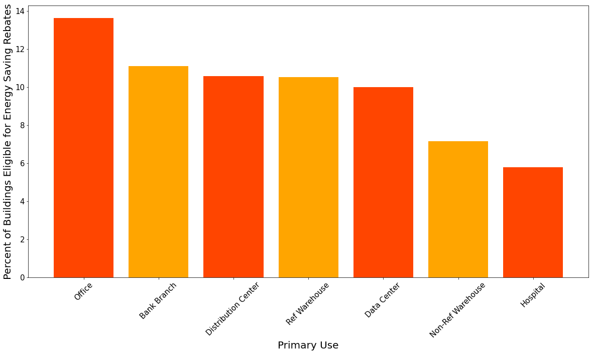

# Predicting Building Energy Use

## Project Understanding

**TALK ABOUT OTHER PROJECTS AND MAIN GOAL OF CAPSTONE**

# NYC Building Annual Energy Use Project

## Business Understanding

Buildings account for 76% of all electricity use in the United States. This translates to 40% of total greenhouse gas emissions from baseline power (coal and oil). Over half of a buildings energy draw comes from environment control:

* lighting
* cooling
* heating
* ventilation
* refrigeration

New York State Energy Plan:

*"The State Energy Plan is a comprehensive roadmap to build a clean, resilient, and affordable energy system for all New Yorkers. The Plan coordinates every State agency and authority that touches energy to advance the REV agenda, unleashing groundbreaking regulatory reform to integrate clean energy into the core of our power grid, redesigning programs to unlock private capital, and actively deploying innovative energy solutions across the State’s own public facilities and operations."* ([EnergyPlan.NY.gov](https://energyplan.ny.gov/))

The plan has the following goals for the state:

* 40% reduction in greenhouse gas emissions from 1990 levels
* 50% of energy generation from renewable energy sources
* 600 trillion Btu increase in statewide energy efficiency

Being able to predict the annual electricity usage of a building based on it's size, primary use and energy efficiency rating would allow for better municipal planning and could help with identifying buildings that over-consume. This would be ideal for planning city sustainability projects as energy consumption could be predicted based on a forecasted change in energy efficiency of buildings. Based on required energy reductions predicted by this model the state could tailor sustainability programs to incentivize building managers to increase energy efficiency (reduce energy consumption).

## Data Understanding

The data comes from [NYC Open Data](https://data.cityofnewyork.us/Environment/Energy-and-Water-Data-Disclosure-for-Local-Law-84-/usc3-8zwd). The target column is the 'Electricity Use - Grid Purchase (kWh)'. Here, the dataset is read in and the used columns are filtered for.

**Target Variable - Annual Energy Usage (kW h):**

Energy use is typically tracked in kWh using electric meters installed by a utility company. NYC's Local Law 87 requires that buildings over 50,000 sqft undergo energy audits which include accurate, annual reporting of energy usage. Over 30,000 buildings within New York City fall under this law.

**Building Energy Efficiency:**

A building's EnergyStar Score is a relative benchmark to other buildings of similar qualities. The higher the score the more energy efficient that building is. An EnergyStar Score of 50 is the median energy efficiency. In the state of New York, buildings above an EnergyStar Score of 70 are eligible for rebates through special state run programs.

**Primary Use:**

The primary use of a building is a general building classification. The top 5 classifications:
1. Multifamily Housing
2. Office
3. K-12 School
4. College/University
5. Hotel

## Findings

RandomForest is used as the final model which produced the lowest RMSE of 664,252 kW h.

This is half of a standard deviation of annual usages for the full dataset.

The top energy users fall into categories that typically have large square footage buildings and contain energy intensive processes.

The above graph shows the top performing primary uses by percentage of buildings that qualify for Energy Star Credit (70th percentile for energy efficiency). Ambulatory/Surgical Centers and Prisons while being in the top for energy consumption are not present in the top performing primary uses.

## Recommendations

- Focus energy efficiency incentive programs on high energy use buildings that have the highest percentage of low EnergyStar Scores (Prisons, Surgical Centers, Wastewater Treatment Plants)
- Forecast Energy Annual Usage by making predictions with targeted EnergyStar Scores

## Future Research

- Use sub-metering data in the model to include the exact energy use (HVAC,Lighting,Computers). For example, understanding which energy use by primary use of the building could help with creating more targeted incentive programs and recommended solutions.
- Incorporate weather data to show effects of seasonality on energy use